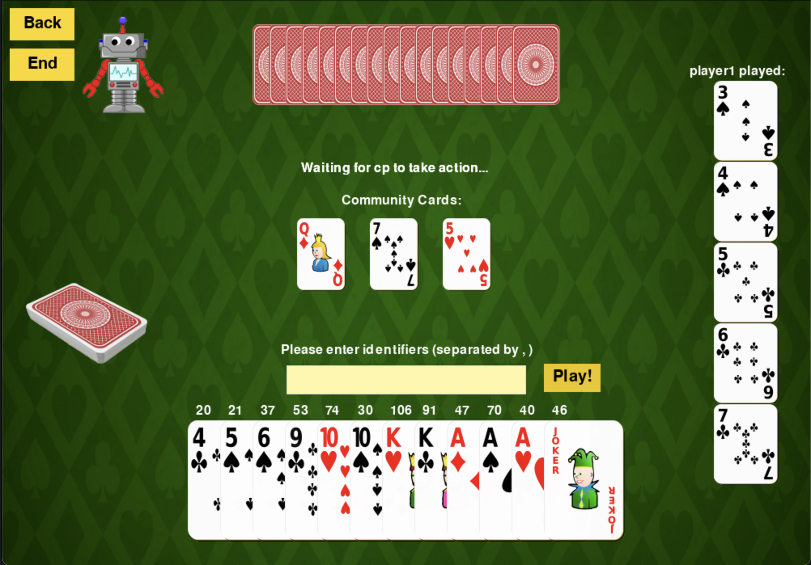

# Card-Game-Designer

**Contributors**: Jared Yao, Simin Liu

## Description

The project will implement a tool for people to build their own card games. It will offer a series of options for people to specify their own game rules. For example, they can adjust the number of rounds, how the cards are distributed, etc. After the rules are determined, they can directly play the card game they designed via the interface we provide. Our aim is to provide multiplayer support by allowing players to hide their hands. For more advanced rules, users are also encouraged to write their own rules or computer strategy with Python scripts through our API. We will also include some sample card games for demonstration purposes, like Blackjack and Texas Hold’em.

## Features

1. A **GUI** that allows users to design the card game with a mouse. It contains an interface that provides options for users to specify their game rules and an actual card table that holds the game. The GUI will contain some degree of animation to simulate the card playing process.
2. **Configuration of card decks**. Users can specify the number of  decks of cards, how one deck constitutes (whether to exclude jokers, etc), the ranks of cards, etc.
3. **Configuration of card deals**. It includes the initial hands, the number of rounds, the number of cards dealt in one round, and whether the player wants to keep drawing cards. Each card will be assigned to a unique label working as an identifier.
4. **Community cards**, which are the cards in the middle of the card table shared across all players. Users can decide whether to have community cards and how they will be updated.
5. **Configuration of cards playing**. Rules include the number of cards played in a round, number of cards in hands, a choice of not playing in a round, etc. The strategy of computers will by default be random, but users are allowed to write Python script to instruct computers with certain strategies. Players will play in order. There will be a text box on the card table for the current player to enter the identifier of the cards they intend to play.
6. **Configuration of bidding** (_Optional_). Users could choose whether to include a bidding system or not. The chip sets can be presets or determined arbitrarily by users. If choosing to include a bidding system, users can decide initial property for each player, how they can stake in the game, and how the winner will take the prize.
7. **Multiplayer support** (_Optional_). The tool supports games with up to 4 players. For games that require confidentiality of each player’s hands, we can use an alternative method to deal the cards. The current plan is using emails to send each player their hands. For each round of card dealing and playing, there will be a new email sent representing the updated hand. To support this feature, users need to enter a host email to send hands to other players. Other players will also need to enter a separate email address to receive the hands.
8. **Central controller system**. It will load the configurations and assign corresponding values for each module. It decides how data is updated and how each round consists of.
9. **Sample card games** using this designer, like Blackjack, Texas Hold’em.

## Users & Stakeholders

### Users

- Software developers
- Everyone who is interested in designing their own card games
- Wesleyan students who are looking for a fun game when planning for a party
- Educators who want to show the danger of gambling
- Everyone who wants to play card games
- Open-source platform users
  
### Stakeholders

- Software developers
- Everyone who is interested in designing their own card games
- Wesleyan students who are looking for a fun game when planning for a party
- Educators and their students
- Everyone who wants to play card games
- Open-source platform users
- Any people around users

## Prerequisites & Installation

### Developping Environment

- Python 3.11
- Pygame 2.5.2
- Pygame_gui 0.6.9

_Please run the following if requirements are not met._

  ```bash
  pip install pygame
  pip install pygame_gui
  ```

Since the software utilized features from Python 3.10, please avoid using Python with lower version.

### Installation & Running

1. **Dowload from Website**

   Download .zip package for the `main` branch and unzip it

2. **Command Line Installation**

   First direct to the location you want to install.

    ```bash
    git clone https://github.com/YAOJaredz/card-game-designer.git
    cd card-game-designer
    ```

3. **Run the Software**

   Run the `run.py` file with Python.

   ```bash
   python -u 'run.py'
   ```

## Usage Instructions

### Opening

The **Openning** page allows users to quickly start a game with exisiting templates or direct to the **Setting** page to design a new game from scratch.

When clicking `Load Templates`, users can choose a template file in .json format. If the checkpoint is valid, a game with this configuration with begin directly.

### Setting

The **Setting** page allow users to specify their desired configuration for each attribute we provide. The manual below introduces the meaning of all attributes and how they will impact the resulting game. If the configuration is not valid, please refer to the manual and fix attributes with invalid types or values.

The `Save` button provides the option to save the current configuration to a template file in .json format, which can be loaded to start immediately next time when playing.

#### Configuration

Inputs for Textbox should be integers only. Inputs of any other types are invalid.

- `Num Rounds`: Set the maximum number of rounds of the game. -1 means infinite rounds and is the default.
- `Num Decks`: Set the number of decks of cards to use. Default to 1.
- `Include Joker?` : Choices whether to include jokers or not. Default to Yes.
- `Order`: Order of ranks in the game. There are 2 options: 0 means _A_ is the smallest rank and _K_ is the biggest (aside from jokers), 1 means _3_ is the smallest rank and _2_ is the biggest. Default to 0.
- `Num Initial Hand`: Set the number of cards in initial hand for each player. Default to 0.
- `Num Cards Dealt Per Round`: Set the number of cards to be dealt to each player each round. Default to 0.
- `Draw Cards?`: Choices to allow players to draw cards or not. Default to Yes.
  - If draw_flag is false, `Draw!` button will not appear in the **Game**.
- `Num Cards Draw`: Set the number of cards to be drawn each time. Default to 1.
- `Community Cards?`: Choices whether to include community cards or not. Default to Yes.
- `First Round of Comm`: The first round to have community cards. Default to 0.
- `Num Comm in Its Round`: Set the number of community cards in the first round of having them. Default to 0.
- `Num Comm Added Per Round`: Set the number of cards to be added to the community cards each round after its first round. Default to 0.
- `Play Cards?`: Choices whether to play cards or not. Default to Yes.
  - If play_flag is false, `Play!` button will be replaced by `Finish` button in the **Game**. `Finish` allows players to end their turns.
- `Num Cards Played Per Round`: Set the maximum number of cards to play. -1 is unrestricted numbers of cards played per round. Default to 1.
- `Multi-User?` (Coming Later): Choices whether to allow multi-user or not. No is the only option for now.
- `Bidding?` (Coming Later): Choices whether to allow bidding or not. No is the only option for now.
- `Repetitive Draw?`: Choices whether to allow drawing cards multiple times in one round or not. Default to Yes.
- `Sort Hands?`: Choices whether to sort cards in order in hand or not. Default to Yes.
- `Display CP?`: Choices whether to display computer player's cards. If choosing No, only the card backs will be seen. Default to Yes.

_More attributes will be supported in the future!_

### Game

The actual game playing page. The designer will generate a card game based on the specified configuration. Players will see their hands and draw and play cards as wanted. Right now, only single-player is supported so players can only play with conputers. Furthermore, by clicking `Back`, players can go back to the configuration page anytime they want.



To draw cards, players can draw cards by clicking `Draw!` and specified number of cards will be added to hands. To play cards, players can enter the number above each card, which is their unique identifiers, into the textbox. By clicking `Play!`, the cards in the text box will be played. Only numbers separated by "," will be taken as valid inputs. If the game does not involve card playing, `Finish` will appear at the place of `Play!` for players to end their rounds.

The Community Cards will be displayed in the middle of the screen shared by all players. On the right lists the cards recently played as a reference.

Player will be the first to play in the game. The game will end when round exceeds the maximum number of rounds in the configuration. Players can also terminate the game in advance by clicking `End`. For more complex customization of ending, please refer to the _**More Customization**_ section. The software will redirect to the title page after game over.

## More Customization

The designer offers a great depth of flexibility for users to make their own card games. First, users can directly edit the template file to generate different card games. Users are also able to design more complicated rules by writing Python scripts to specify details of the game through our open API.

### Computer Strategy

Users can design complex strategy patterns for computer in `cp_strategy.py`. The computer will take several parameters imitating a player situation and users design their strategy for playing and drawing cards. Users can come up with creative strategies for instruct computer behaviors or even integrate AI models for more optimal behaviors. You can then play with them to test their ability and work on improvements.

### Game Ends

The conditions for ending the games can also be elaborated in `is_end.py`. The function `end_game` will take a card database as the input and users are free to add conditions that determine the end of the game. For example, the game can end when a player has too few or too many cards in hand or simply end the game at random and compare hands after the game overs. There are many possibilities in this process.

The databse has 4 major components:

- `deck` (set) represents the cards haven't been dealt yet.
- `hands` (dict) represents the hands of each player, and each hand is a list of cards. The player name is stored in `database.players`.
- `community` (list) represents the community cards.
- `discard` (set) stores all the cards that have been played already. Accessing of data inside is not recommended as people do not examine the played cards in actual card games.

_More information please refer to its definitions [here](data_processing/database.py)._

If you want to use these customizations, please add one attribute in the template file. Please include the path to the computer strategy file uner "cp_strategy_path". It is the same for game ending under "is_end_path". You can find template customization files with more detailed information in `user_scripts` and we are working on opening more APIs!

## Sample Games

We also have included some sample games to introduce the customization and showcase their performance in traditional card games. The templates of the following sample games can be found in [`sample_games`](save/sample_games). You can load the template file in the software with `Load Templates` and select the .json template file.

### Blackjack

Blackjack is a casino card game where players aim for a hand value close to 21. Players get two cards and decide to "hit" or "stand." Face cards are worth 10, Aces can be 1 or 11. The goal is to beat the dealer without going over 21 by sum.

The game is designed with an example computer strategy that will have a lower probability of keep drawing cards as their card goes bigger. Players can also draw as many cards as they want and if the cards exceed 21, they can press `Finish` to complete their turn.

### Poker

Players will be dealt with 17 cards at the beginning of the game and they can play cards following some patterns. Who first play all the cards in hand will win the game. This game has customized end_game script that ends the game as on player runs out of cards.

### Single-Player Texas Hold'em

Texas Hold'em is a popular poker variant where players receive two private cards and share five community cards, with the goal of forming the best hand. We only implemented a single-player version of it. The community cards will be added foe each round until reaching 5, and players can compete with the computer for better hands.

## Future directions

- Multiplayer support
- Bidding support
- Openning more configuration attributes and APIs to support more games
